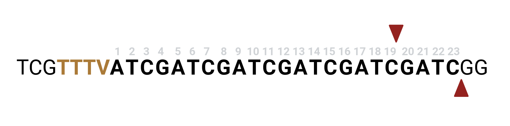

# CRISPRware

CRISPRware is a comprehensive toolkit designed to preprocess NGS data and identify, score, and rank guide RNAs (gRNAs) for CRISPR experiments. It supports RNASeq, RiboSeq, ATACSeq, DNASESeq, ChIPSeq, and other genomic preprocessing techniques.

## Table of Contents
1. [Installation](#installation)
2. [Usage](#usage)
3. [Methods](#methods)
    - [CRISPRware Workflow](#crisprware-workflow)
    - [RNASeq Guided Preprocessing](#rnaseq-guided-preprocessing)
    - [RiboSeq Guided Preprocessing](#riboseq-guided-preprocessing)
    - [Genomic Preprocessing](#genomic-preprocessing)
    - [Identifying Guide RNAs](#identifying-guide-rnas)
    - [Building Off-target Index](#building-off-target-index)
    - [Scoring Guide RNAs](#scoring-guide-rnas)
    - [Ranking Guide RNAs](#ranking-guide-rnas)


## Installation
With conda installed perform the following commands.

```
git clone https://github.com/ericmalekos/crisprware crisprware

cd crisprware

conda env create -f environment.yml

conda activate crisprware

chmod +x setup.py

./setup.py install
```

## Basic Usage
### Input Requirements
- **FASTA File**
### Optional Inputs
- **BED File**: A BED file can be provided to specify regions of interest within the genome. This file can help to limit the search space for gRNA identification.
- **GTF/GFF File**: A GTF or GFF file can be used to provide gene annotations. This information can be used to filter gRNAs based on specific genomic features such as exons or coding sequences .

### CRISPRware Workflow
We demonstrate usage with ce11 chromosome III fasta and NCBI GTF, included in the tests/test/data/ce11 directory: 
```
# Note the off-target index is limited to chrIII, not the full ce11 genome

index_genome -f tests/test_data/ce11/chrIII_sequence.fasta

# Default settings generate NGG protospacer guides

generate_guides \
-f tests/test_data/ce11/chrIII_sequence.fasta \
-k tests/test_data/ce11/chrIII_ce11.ncbiRefSeq.gtf \
--feature CDS

# Scoring will take ~5 minutes and uses 8 threads by default.
# Change this with --threads <int>

score_guides \
-b sgRNAs/sgRNAs.bed \
-i GscanIndex/GscanIndex \
--tracr Chen2013

rank_guides \
-k ScoredSgRNAs/ScoredSgRNAs.tsv \
-t tests/test_data/ce11/ce11.ncbiRefSeq.gtf \
-f CDS \
-c RS3_score_Chen2013 specificity_gscan_index \
-m 0 0.2 \
-p 5 65 \
-r RS3_score_Chen2013 \
--output_all
```

### Generate Guides Alternate PAMs

Default generate_guides settings are equivalent to

```
generate_guides \
-f <fasta> \
--pam [-p] NGG
--sgRNA_length [-l] 20
--context_window [-w] 4 6
--active_site_offset_5 [-5] "-4"
--active_site_offset_3 [-5] "-4"

```


Note that `context_window[0]` extends the sequence in the 5' direction, `context_window[1]` in the 3' direction. `active_site_offset`s are calculated relative to PAM position, and should be passed in quotes if they are negative.


For Cas12A guide selection change `generate_guides` settings to

```
generate_guides \ 
-f <fasta> \
--pam TTTV --pam_5_prime -5 19 -3 23 -l 23 -w 7 2
```




Here the pam is 5-prime to the protospacer so `--pam_5_prime` flag is set and the length.

For on-target scoring of Cas12A guides, first install [crisprScore](https://github.com/crisprVerse/crisprScore).

```./scripts/crisprscore.R 30_sgrnas.bed 11 DeepSpCas9_sgRNAs.bed```


Guidescan2 is not compatible with PAMs 5' to protospacers, for off-target scoring in these cases I suggest [Flash Fry](https://github.com/mckennalab/FlashFry?tab=readme-ov-file)


## Methods

CRISPRware offers a series of modules to preprocess NGS data and determine suitable gRNAs for CRISPR applications.

### RNASeq Guided Preprocessing

A number of scripts exist to preprocess NGS data prior to determining gRNAs. The module `preprocess_annotation` takes processed RNASeq TPMs from Kallisto/Salmon (short-read) or FLAIR/Mandalorian (long-read) from one or more samples along with the GTF/GFF gene annotation. If multiple samples are passed, max, min, median, and mean TPM values for each transcript are determined, and the user can supply minimum cut-offs for any combination of these to filter out lowly expressed isoforms. All detected isoforms (TPM > 0) are kept by default. The user can also set an integer flag `--top-n <n>` which will filter out all but the <n> most highly expressed isoform for each gene.

Following filtering, a filtered GTF is created, along with four optional GTF files: shortest, longest, metagene, and consensus. Each of these four GTFs will have a single isoform model for a given gene.

### RiboSeq Guided Preprocessing

RiboSeq is a technique that allows researchers to evaluate the coding potential of canonical and noncanonical open reading frames (ORFs) by sequencing ribosome-protected fragments. CRISPRware can take ORFs called from RiboSeq and generate new GTFs with de novo CDS entries. Currently, GTFs can be generated from the output of either PRICE or Ribo-TISH, two widely used RiboSeq processing tools.

### Genomic Preprocessing

Targeting noncoding elements can be guided by any NGS data that yields BED coordinate files. Additionally, a helper script `bigwig_to_signalwindow.py` can take a BED and BigWig signal file and return the window in each BED entry that has the highest mean signal.

### Identifying Guide RNAs

The first processing module in CRISPRware is `generate_guides`, which scans an input genome for protospacers based on a user-defined PAM sequence. GTF/GFF and BED files can be passed to limit the search space to regions of interest.

### Building Off-target Index

Off-target scoring is performed by GuideScan2, and the wrapper script `index_genome.py` is used to generate the index from a fasta file. The wrapper script includes the option to subset the fasta in order to calculate the off-target effects against user-defined areas of interest.

### Scoring Guide RNAs

Following gRNA identification, the output is passed to `score_guides.py`, which calculates the GuideScan2 off-target scoring and Ruleset 3 on-target scoring for each guide. Both scoring methods include multithreading, and the user can specify the number of gRNAs to process concurrently.

### Ranking Guide RNAs

The final module, `rank_guides`, takes the scored guides as input and filters them according to user-defined criteria. Any number of scoring columns and minimum cut-offs can be used to filter out undesirable gRNAs.

