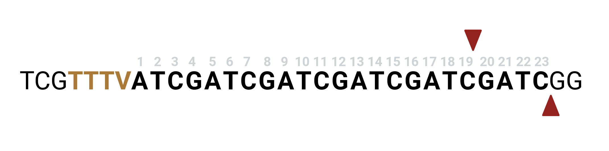

# generate_guides

Find every protospacer for a PAM in the genome (optionally restricted to regions), with the context
window the on-target scorers need.

```bash
crisprware generate_guides -f tests/test_data/ce11/chrIII_sequence.fasta \
  -k tests/test_data/ce11/chrIII_ce11.ncbiRefSeq.gtf --feature CDS
```

Every NGG protospacer whose cut site lands in a CDS -> `chrIII_sequence_gRNA/chrIII_sequence_gRNA.bed`
(312,925 guides):

```text
#chr   start  stop   id,sequence,pam,chromosome,position,sense              context                         strand
chrIII 1482   1502   chrIII:1483:+,GGAATGTACTTCTTCCCAAA,NGG,chrIII,1483,+   TGTTGGAATGTACTTCTTCCCAAAAGGTTC  +
```

## Options you reach for

- `-p/--pam NGG` (any IUPAC code, auto-expanded), `-l/--sgRNA_length 20`.
- `-w/--context_window <up> <down>` -- flanking context for scoring (`4 6` for RuleSet3; Cas12a uses
  `-w 4 3` with `--pam_5_prime`).
- **Where**: `-k/--locations_to_keep <bed/gtf>` + `--feature CDS` (keep guides cutting here),
  `--locations_to_discard` (drop guides cutting here), `--join_operation merge|intersect` for multiple
  keep files.
- **Quality filters**: `--gc_range lo hi`, `--discard_poly_T` (PolIII), `--discard_poly_G`,
  `--restriction_patterns GCGGCCGC ...` (with `--flank_5`/`--flank_3` vector context).
- `--pam_5_prime`, `-5/-3` active-site offsets -- Cas12a geometry.

```{tip}
The `context` column (not the bare spacer) is what `score_guides` feeds to the on-target models, so
generate with the window the scorer expects.
```

## PAM geometry

The defaults target **SpCas9** (3' `NGG` PAM):

```bash
crisprware generate_guides -f <fasta> --pam NGG --sgRNA_length 20 \
  --context_window 4 6 --active_site_offset_5 ="-4" --active_site_offset_3="-4"
```


All [IUPAC ambiguity codes](https://genome.ucsc.edu/goldenPath/help/iupac.html) are auto-expanded
(`NGG` -> `AGG, TGG, CGG, GGG`). `context_window[0]` extends 5', `[1]` extends 3'; the
`active_site_offset`s are relative to the PAM-protospacer position (quote negatives, e.g.
`-5="-4"`).

For **Cas12a** (5' `TTTV` PAM), set `--pam_5_prime` and the longer spacer:

```bash
crisprware generate_guides -f <fasta> --pam TTTV --pam_5_prime -5 19 -3 23 -l 23 -w 4 3
```



`-w 4 3` emits a 34-nt context (4 up + 4 PAM + 23 protospacer + 3 down), exactly what DeepCpf1,
enPAM+GB, and enseq-DeepCpf1 expect (pre-0.2 `-w 8 3` is no longer needed).
